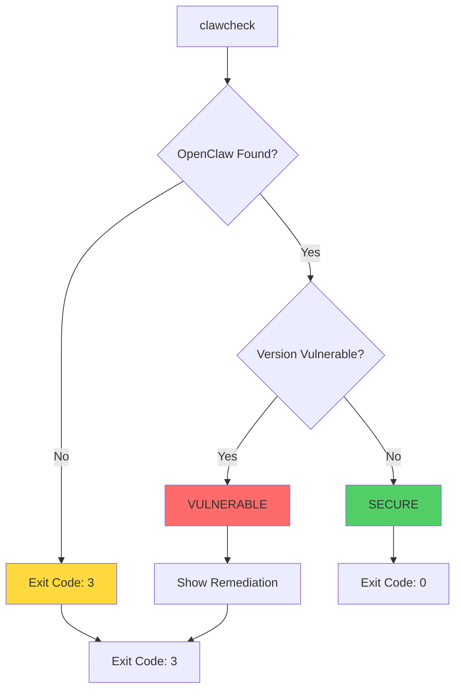
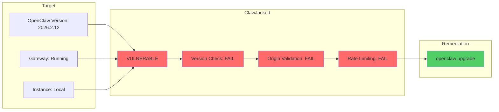
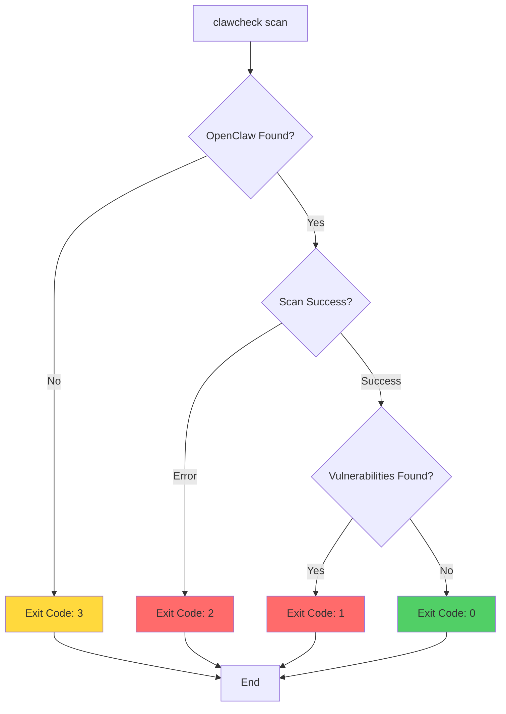
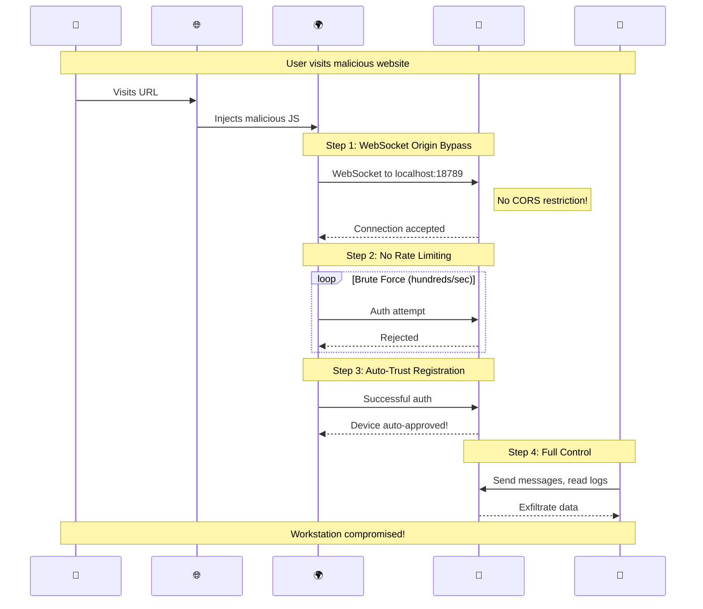
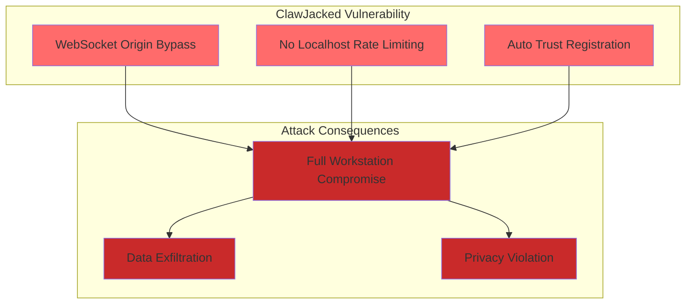
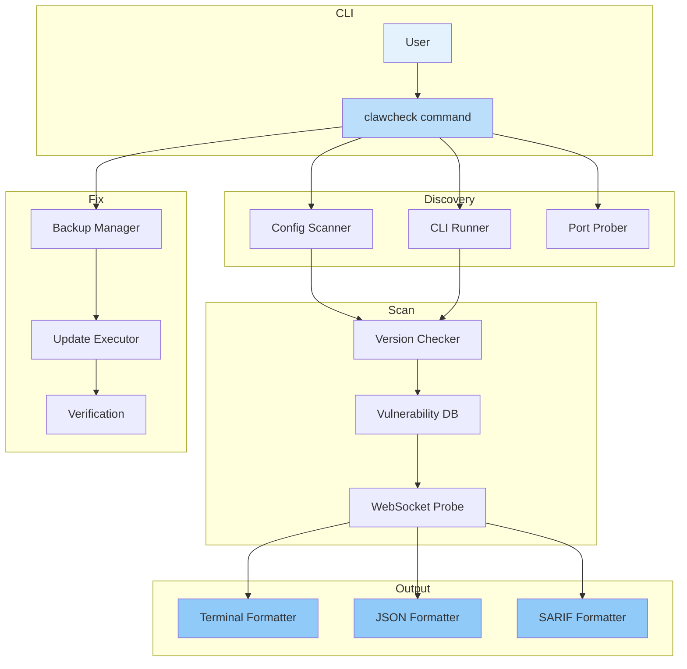
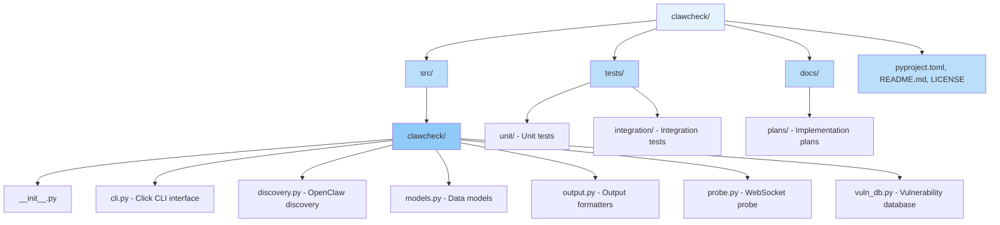

# ClawCheck

<div align="center">

**🛡️ OpenClaw Vulnerability Scanner**

Detect the **ClawJacked** vulnerability (CVE-2026-CLAW) in OpenClaw installations

[](https://www.python.org/downloads/)
[](LICENSE)

</div>

## Quick Start

```bash
pip install clawcheck
clawcheck
```

## Overview

**ClawCheck** is a CLI security tool that detects the **ClawJacked vulnerability** in OpenClaw installations. The vulnerability, disclosed by Oasis Security on February 26, 2026, allows any website to silently hijack OpenClaw agents through WebSocket exploitation.

**What it does:**
- ✅ Scans for OpenClaw installations
- ✅ Checks version against vulnerable range (`< 2026.2.25`)
- ✅ Probes WebSocket gateway for security indicators
- ✅ Provides remediation guidance
- ✅ CI/CD integration (JSON/SARIF output)

**What it doesn't do:**
- ❌ No external data transmission (offline-capable)
- ❌ No brute-force attacks (read-only probes)
- ❌ No system modifications (in scan mode)

## Installation

### pip (Recommended)

```bash
pip install clawcheck
```

### pipx (Isolated Installation)

```bash
pipx install clawcheck
```

### From Source

```bash
git clone https://github.com/yourusername/clawcheck.git
cd clawcheck
pip install -e .
```

## Usage

### Basic Scan

```bash
clawcheck
```

#### Scan Flow



#### Output Example



### JSON Output

```bash
clawcheck --json
clawcheck --json --output results.json
```

### SARIF Output (CI/CD)

```bash
clawcheck --sarif
```

### Verbose Mode

```bash
clawcheck -v        # Verbose
clawcheck -vv       # Extra verbose (includes WebSocket probing)
```

### Fix Mode

```bash
# Dry run - see what would be done
clawcheck fix --dry-run

# Apply fix (with confirmation)
clawcheck fix

# Apply fix without confirmation
clawcheck fix --force
```

### Monitoring Mode

```bash
# Monitor continuously (60s interval)
clawcheck monitor

# Custom interval
clawcheck monitor --interval 30

# With log file
clawcheck monitor --log-file clawcheck.log
```

### Advanced Options

```bash
# Custom timeout
clawcheck --timeout 60

# Custom config path
clawcheck --config-path /custom/path/openclaw.json

# All options combined
clawcheck -vv --json --output scan.json --timeout 60
```

## Exit Codes



| Code | Meaning | Use Case |
|------|---------|----------|
| 0 | SECURE | No vulnerabilities found |
| 1 | VULNERABLE | Vulnerabilities detected |
| 2 | ERROR | Scan error (permissions, timeout, etc.) |
| 3 | NOT_FOUND | OpenClaw not installed or not running |

**Script Integration Example:**

```bash
#!/bin/bash
clawcheck --json --output scan.json
EXIT_CODE=$?

case $EXIT_CODE in
  0) echo "✓ Secure - no action needed" ;;
  1) echo "✗ Vulnerable - apply fix with: clawcheck fix" ;;
  2) echo "⚠ Error - check logs" ;;
  3) echo "○ OpenClaw not found" ;;
esac

exit $EXIT_CODE
```

## About the Vulnerability

### ClawJacked (CVE-2026-CLAW)

**Disclosed:** February 26, 2026
**Severity:** HIGH
**Affected Versions:** OpenClaw `< 2026.2.25`

#### Attack Chain



#### Vulnerability Components



**Impact:** Full workstation compromise initiated from a browser tab

**Fix:** Update to OpenClaw `2026.2.25` or later

**Source:** [Oasis Security Vulnerability Disclosure](https://www.oasis.security/blog/openclaw-vulnerability)

## Safety & Privacy

- ✅ **Offline-capable** - No external data transmission
- ✅ **Read-only probes** - No system modification
- ✅ **Rate-limited** - 1 request/second (AWS cooperative scanning guidelines)
- ✅ **No brute-force** - Never attempts password guessing
- ✅ **Open source** - Fully auditable code

## Development

### Architecture



### Running Tests

```bash
# Install dev dependencies
pip install -e ".[dev]"

# Run tests
pytest

# Run with coverage
pytest --cov=clawcheck --cov-report=html
```

### Project Structure



**File Overview:**

| Module | Purpose |
|--------|---------|
| `cli.py` | Click CLI interface (scan/fix/monitor commands) |
| `discovery.py` | OpenClaw discovery (config, CLI, port probing) |
| `models.py` | Data models (ScanResult, Finding, ExitCode, etc.) |
| `output.py` | Terminal/JSON/SARIF formatters |
| `probe.py` | WebSocket vulnerability probe |
| `vuln_db.py` | Vulnerability database with version checking |

## Contributing

Contributions are welcome! Please:

1. Fork the repository
2. Create a feature branch
3. Make your changes
4. Add tests for new functionality
5. Run tests and linting
6. Submit a pull request

## License

MIT License - see LICENSE file for details

## Disclaimer

This tool is for security testing purposes only. Always obtain proper authorization before scanning systems. The authors are not responsible for misuse of this software.

## Links

- [Oasis Security: ClawJacked Vulnerability](https://www.oasis.security/blog/openclaw-vulnerability)
- [OpenClaw Repository](https://github.com/openclaw/openclaw)
- [SARIF v2.1.0 Specification](https://docs.oasis-open.org/sarif/sarif/v2.1.0/sarif-v2.1.0.html)

---

**Stay secure! 🛡️**
