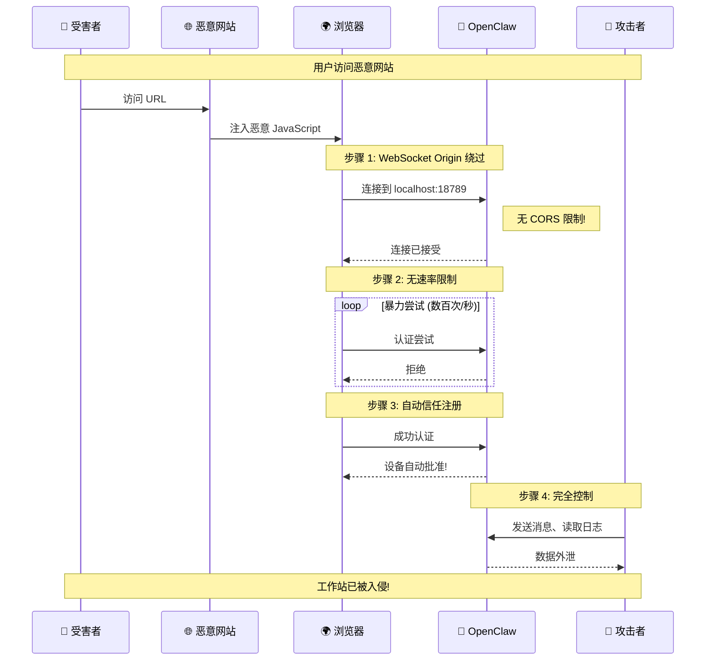
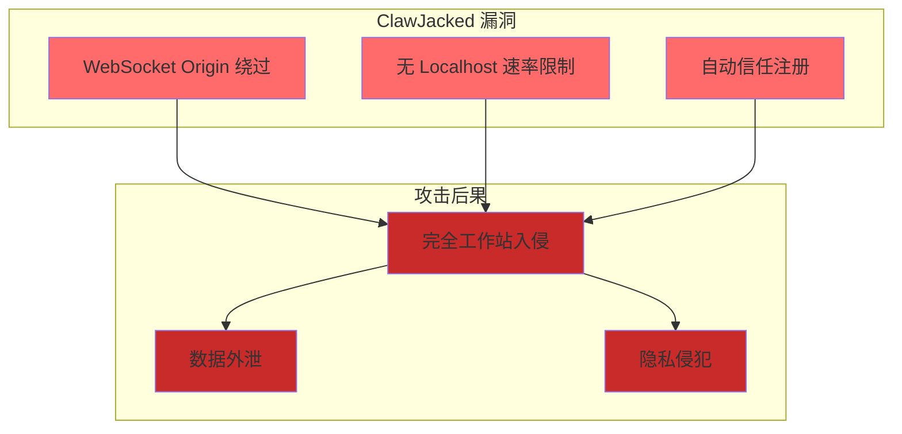
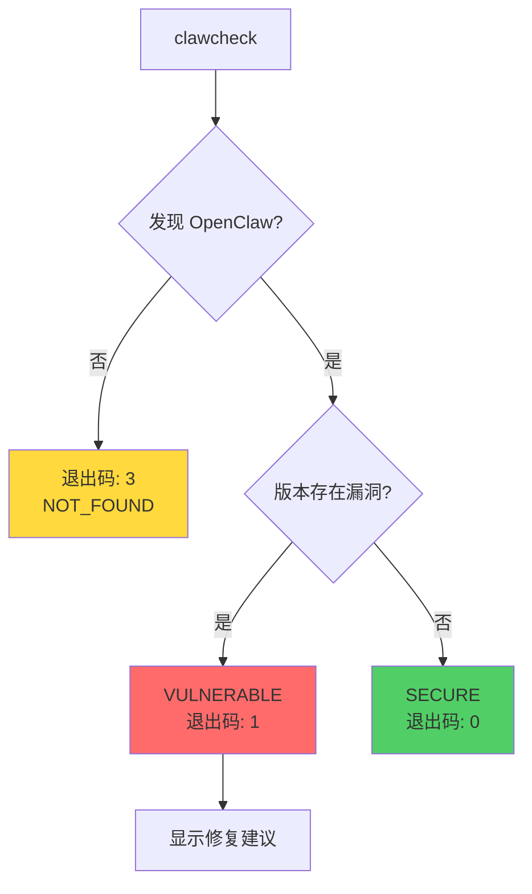
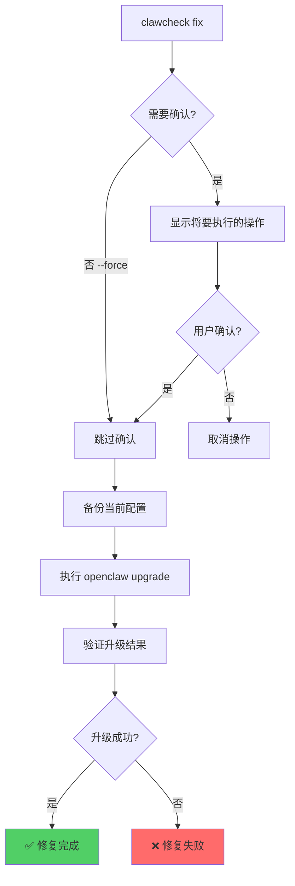
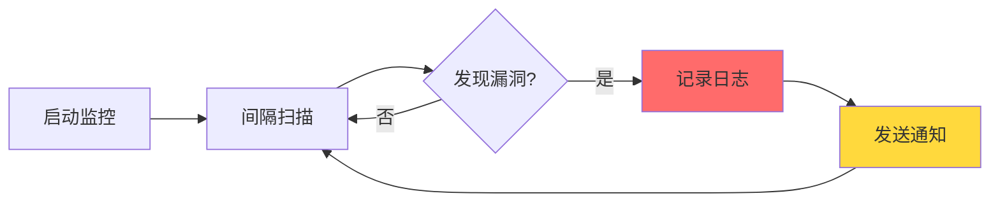
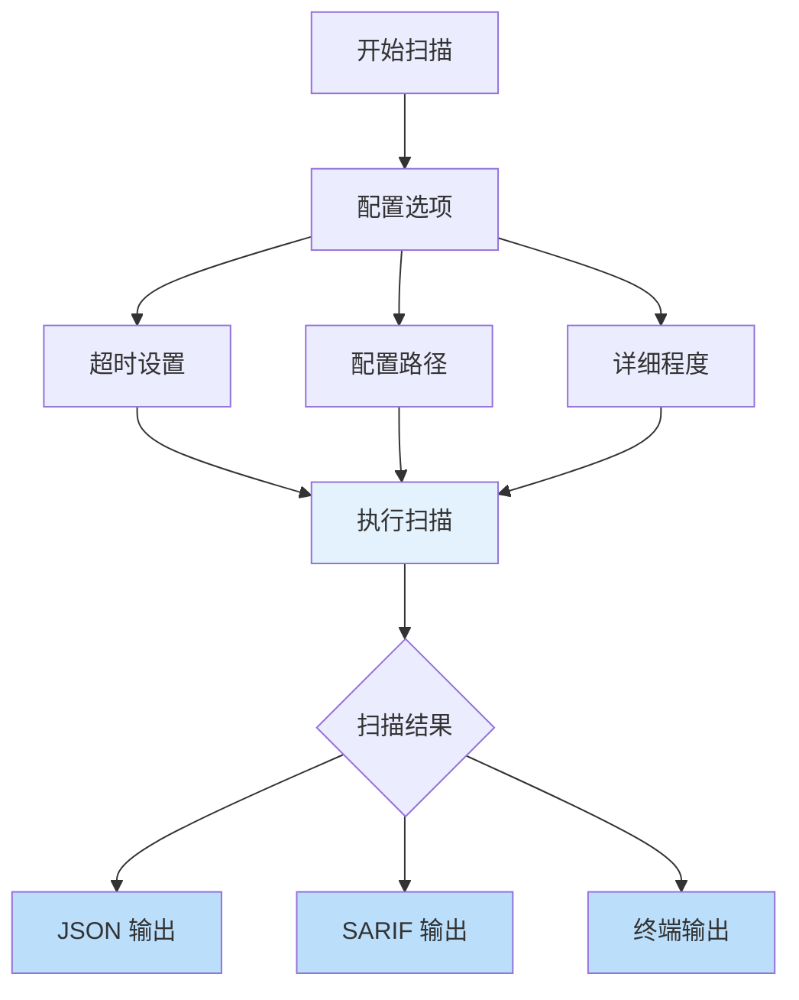
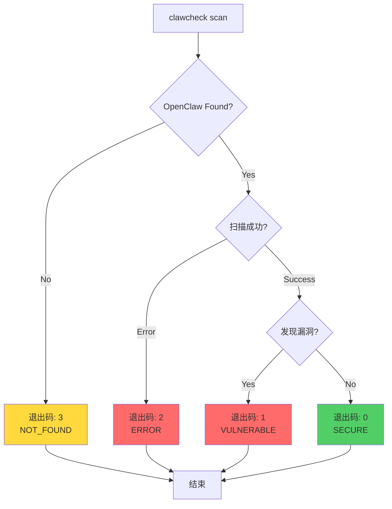
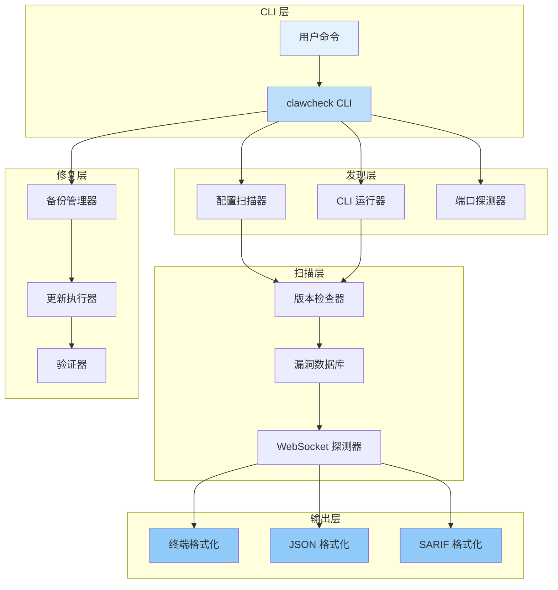
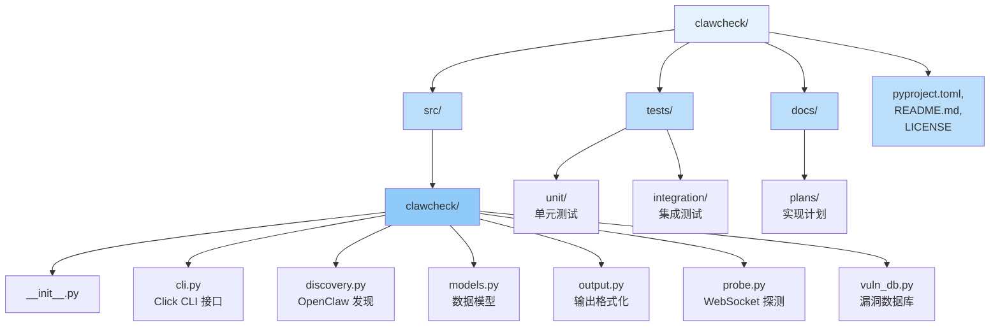

# 🛡️ ClawCheck

> **OpenClaw Vulnerability Scanner** — Detect the ClawJacked vulnerability (CVE-2026-CLAW)

[](https://www.python.org/downloads/)
[](https://pypi.org/project/clawcheck/)
[](LICENSE)

---

## 📋 产品定位

**ClawCheck** 是一个命令行安全工具，用于检测 OpenClaw 安装中的 **ClawJacked 漏洞**（CVE-2026-CLAW）。

该漏洞由 Oasis Security 于 2026 年 2 月 26 日披露，允许任何网站通过 WebSocket 利用程序静默劫持 OpenClaw 代理。

**核心特点：**

| 特性 | 说明 |
|------|------|
| 🔍 **自动发现** | 自动检测本地 OpenClaw 安装 |
| 🎯 **版本检测** | 对比已知漏洞版本范围 |
�� **深度探测** | WebSocket 安全指标探测 |
| 🔒 **隐私优先** | 完全离线能力，无外部数据传输 |
| 🤖 **CI/CD 集成** | 支持 JSON/SARIF 输出格式 |
| 🛠️ **自动修复** | 一键升级到安全版本 |

**目标用户：** 安全研究人员、DevOps 工程师、系统管理员、OpenClaw 用户

---

## ⚠️ 关于 ClawJacked 漏洞

### 漏洞概览

| 属性 | 值 |
|------|------|
| **CVE 编号** | CVE-2026-CLAW |
| **披露日期** | 2026年2月26日 |
| **严重程度** | HIGH |
| **影响版本** | OpenClaw < 2026.2.25 |
| **修复版本** | OpenClaw >= 2026.2.25 |
| **披露来源** | [Oasis Security](https://www.oasis.security/blog/openclaw-vulnerability) |

### 攻击链



### 漏洞组件



**影响：** 可从浏览器标签页发起的工作站完全入侵

**修复：** 更新到 OpenClaw 2026.2.25 或更高版本

---

## 🚀 快速启动

### 环境要求

| 工具 | 版本要求 |
|------|----------|
| Python | 3.9+ |
| OpenClaw | 任意版本（用于检测） |

### 安装

#### 方式一：pip 安装（推荐）

```bash
pip install clawcheck
clawcheck
```

#### 方式二：pipx 隔离安装

```bash
pipx install clawcheck
```

#### 方式三：从源码安装

```bash
git clone https://github.com/yourusername/clawcheck.git
cd clawcheck
pip install -e .
```

### 基本使用

```bash
# 执行扫描
clawcheck

# 查看详细输出
clawcheck -v

# 查看超详细输出（包含 WebSocket 探测）
clawcheck -vv
```

---

## 📖 功能用例

### 用例一：基本漏洞扫描

执行本地 OpenClaw 安装的安全扫描。



**输出示例：**

```
🛡️  ClawCheck - OpenClaw Vulnerability Scanner

📍 发现 OpenClaw 实例
   版本: 2026.2.12
   路径: /home/user/.openclaw/openclaw.json
   网关: 运行中 (127.0.0.1:18789)

⚠️  检测到漏洞
   CVE-2026-CLAW (ClawJacked)
   严重程度: HIGH

   漏洞指标:
   ✗ 版本检查: FAIL (2026.2.12 < 2026.2.25)
   ✗ Origin 验证: FAIL
   ✗ 速率限制: FAIL

🔧 修复建议:
   openclaw upgrade
```

---

### 用例二：JSON/SARIF 输出（CI/CD 集成）

生成机器可读的扫描结果，用于 CI/CD 流水线集成。

**JSON 输出：**

```bash
clawcheck --json
clawcheck --json --output results.json
```

**SARIF 输出（用于 GitHub Actions、GitLab CI 等）：**

```bash
clawcheck --sarif --output sarif.json
```

**GitHub Actions 集成示例：**

```yaml
name: Security Scan
on: [push, pull_request]

jobs:
  clawcheck:
    runs-on: ubuntu-latest
    steps:
      - uses: actions/checkout@v3
      - run: pip install clawcheck
      - run: clawcheck --sarif --output sarif.json
      - uses: github/codeql-action/upload-sarif@v2
        with:
          sarif_file: sarif.json
```

---

### 用例三：自动修复

一键升级 OpenClaw 到安全版本。



**使用方式：**

```bash
# 预演模式 - 查看将要执行的操作
clawcheck fix --dry-run

# 执行修复（需要确认）
clawcheck fix

# 强制修复（无需确认）
clawcheck fix --force
```

---

### 用例四：持续监控

持续监控 OpenClaw 安全状态，适合长期运行的服务器。



**使用方式：**

```bash
# 持续监控（默认 60 秒间隔）
clawcheck monitor

# 自定义间隔（30 秒）
clawcheck monitor --interval 30

# 带日志文件
clawcheck monitor --log-file clawcheck.log
```

---

### 用例五：高级扫描选项

针对特定场景的扫描配置。



**使用示例：**

```bash
# 自定义超时时间
clawcheck --timeout 60

# 自定义配置路径
clawcheck --config-path /custom/path/openclaw.json

# 组合多个选项
clawcheck -vv --json --output scan.json --timeout 60
```

---

## 📊 退出码与脚本集成

### 退出码说明



| 退出码 | 含义 | 使用场景 |
|--------|------|----------|
| 0 | SECURE | 未发现漏洞 |
| 1 | VULNERABLE | 检测到漏洞 |
| 2 | ERROR | 扫描错误（权限、超时等） |
| 3 | NOT_FOUND | 未安装或未运行 OpenClaw |

**脚本集成示例：**

```bash
#!/bin/bash
# 安全检查脚本

clawcheck --json --output scan.json
EXIT_CODE=$?

case $EXIT_CODE in
  0)
    echo "✓ 安全 - 无需操作"
    # 正常继续 CI 流程
    ;;
  1)
    echo "✗ 存在漏洞 - 请执行: clawcheck fix"
    # 阻止部署
    exit 1
    ;;
  2)
    echo "⚠ 扫描错误 - 请检查日志"
    exit 2
    ;;
  3)
    echo "○ 未安装 OpenClaw - 跳过检查"
    # 可能是开发环境
    ;;
esac

exit $EXIT_CODE
```

---

## 🏗️ 项目架构

### 系统架构



### 项目结构



### 模块说明

| 模块 | 功能 |
|------|------|
| `cli.py` | Click CLI 接口（scan/fix/monitor 命令） |
| `discovery.py` | OpenClaw 发现（配置、CLI、端口探测） |
| `models.py` | 数据模型（ScanResult、Finding、ExitCode 等） |
| `output.py` | 终端/JSON/SARIF 格式化器 |
| `probe.py` | WebSocket 漏洞探测器 |
| `vuln_db.py` | 漏洞数据库与版本检查 |

---

## 🔒 安全与隐私

ClawCheck 遵循负责任的扫描原则：

| 特性 | 说明 |
|------|------|
| ✅ **离线能力** | 无外部数据传输，完全本地运行 |
| ✅ **只读探测** | 不修改系统配置（扫描模式） |
| ✅ **速率限制** | 1 请求/秒（遵循 AWS 协作扫描指南） |
| ✅ **无暴力破解** | 从不尝试密码猜测 |
| ✅ **开源代码** | 完全可审计的代码 |

**安全约束：**

- 探测测试延迟：1 秒/请求
- 连接超时：30 秒
- 操作超时：10 秒
- 不执行实际暴力攻击
- 仅限只读操作

---

## 🧪 开发

### 运行测试

```bash
# 安装开发依赖
pip install -e ".[dev]"

# 运行测试
pytest

# 运行带覆盖率的测试
pytest --cov=clawcheck --cov-report=html
```

### 代码质量

```bash
# 代码格式化
black src/

# 代码检查
ruff check src/

# 类型检查
mypy src/
```

---

## 🤝 贡献

欢迎贡献！请遵循以下步骤：

1. Fork 本仓库
2. 创建功能分支 (`git checkout -b feature/amazing-feature`)
3. 提交更改 (`git commit -m 'Add amazing feature'`)
4. 推送到分支 (`git push origin feature/amazing-feature`)
5. 开启 Pull Request

---

## 📄 许可证

MIT License — 详见 [LICENSE](LICENSE) 文件

---

## ⚠️ 免责声明

本工具仅供安全测试使用。扫描系统前请务必获得适当授权。作者不对本软件的滥用负责。

---

## 🔗 相关链接

- [Oasis Security: ClawJacked 漏洞披露](https://www.oasis.security/blog/openclaw-vulnerability)
- [OpenClaw 仓库](https://github.com/openclaw/openclaw)
- [SARIF v2.1.0 规范](https://docs.oasis-open.org/sarif/sarif/v2.1.0/sarif-v2.1.0.html)
- [PyPI 包](https://pypi.org/project/clawcheck/)

---

**保持安全！ 🛡️**
